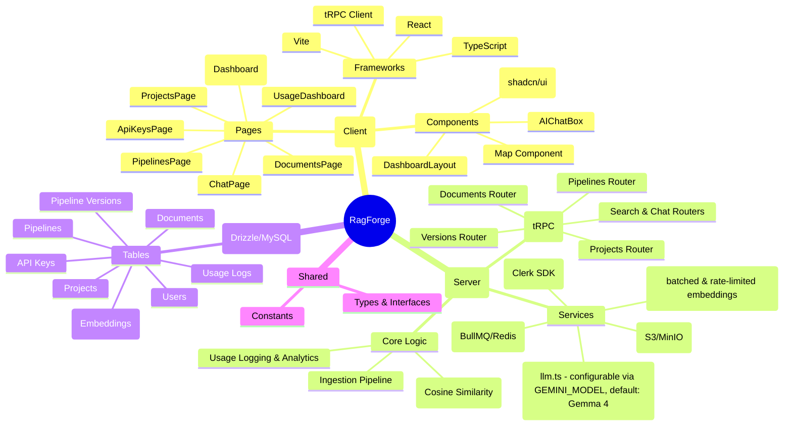

# RagForge Application Mind-Map

## Key Features & Workflows

### 1. RAG Pipeline Management
Users can create **Projects**, each containing multiple **Pipelines**. Pipelines are versioned, allowing users to experiment with different configurations (e.g., chunk size, overlap).

### 2. Document Ingestion
Documents are uploaded using a robust mechanism: first attempting a direct S3/R2 upload via presigned URLs for efficiency, and falling back to a server-side proxy upload if direct access fails (e.g., due to CORS in local dev). Server-side uploads use disk-based temporary storage with automatic cleanup after S3 migration to optimize memory usage. The system tracks granular ingestion stages (**uploading**, **extracting**, **embedding**, **ready**) to provide real-time feedback. Embedding generation is processed using optimized parallel batching (concurrency of 10) with automatic retry and exponential backoff, ensuring maximum throughput while staying within API rate limits. This is handled by a background queue (`BullMQ`) with a synchronous fallback.

### 3. Vector Search & RAG Chat
The system performs **Cosine Similarity** search over chunks to find relevant context for user queries. The **Chat** feature uses this context to provide grounded LLM responses, utilizing **Gemma 4** for frontier-level reasoning and agentic capabilities.

### 4. API & External Access
Users can generate **API Keys** to interact with their RAG pipelines programmatically, with built-in usage tracking and analytics.

### 5. Infrastructure
- **Type Safety**: End-to-end type safety using tRPC and Drizzle.
- **Scalability**: Background processing for heavy tasks (embeddings).
- **Persistence**: MySQL for metadata and structured data; Vector storage (implied) for embeddings.
