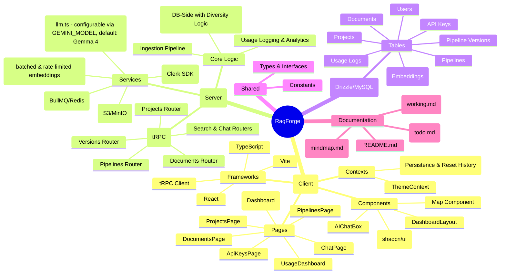

# RagForge Application Mind-Map

## Key Features & Workflows

### 1. RAG Pipeline Management
Users can create **Projects**, each containing multiple **Pipelines**. Pipelines are versioned, allowing users to experiment with different configurations (e.g., chunk size, overlap).

### 2. Document Ingestion
Documents are uploaded using a robust mechanism: first attempting a direct S3/R2 upload via presigned URLs for efficiency, and falling back to a server-side proxy upload if direct access fails. Once uploaded, the heavy lifting (text extraction, chunking, and embedding) is handled asynchronously by a background worker powered by **BullMQ** and **Redis**. This architecture ensures the web server remains responsive regardless of document size. The system tracks granular ingestion stages (**uploading**, **extracting**, **embedding**, **ready**) and provides real-time progress updates via tRPC.

### 3. Vector Search & RAG Chat
The system performs **High-Performance Vector Search** directly in the database using TiDB's `VEC_COSINE_DISTANCE`. It implements a **Diversity-Aware** retrieval strategy (Top-N chunks per document) to ensure that queries "look into all files" across the knowledge base. The **Chat** feature uses this diverse context to provide grounded LLM responses, utilizing **Gemma 4** for frontier-level reasoning and agentic capabilities.

### 4. API & External Access
Users can generate **API Keys** to interact with their RAG pipelines programmatically, with built-in usage tracking and analytics.

### 5. Infrastructure
- **Type Safety**: End-to-end type safety using tRPC and Drizzle.
- **Scalability**: Background processing for heavy tasks (embeddings).
- **Persistence**: MySQL for metadata and structured data; Vector storage (implied) for embeddings.
