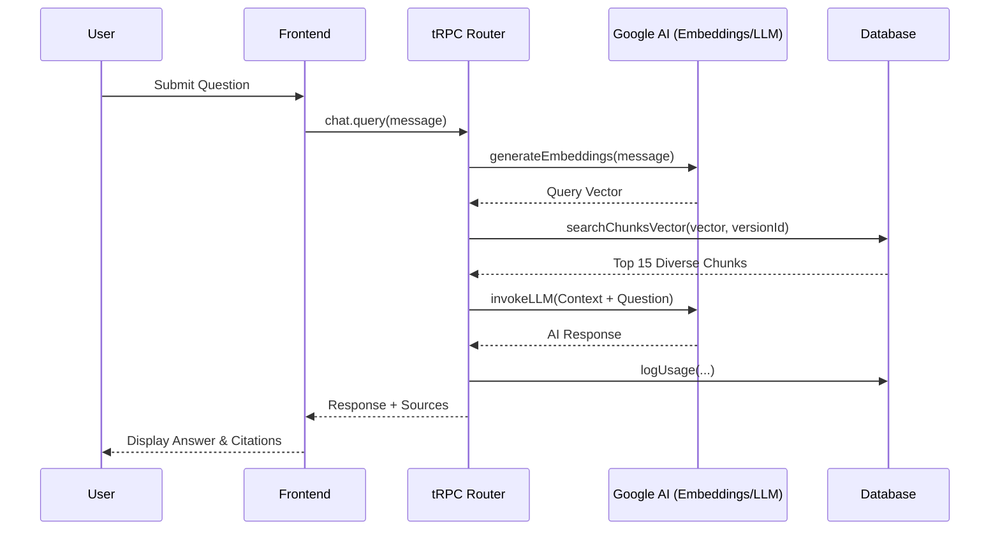

# Workings of codebase

# Codebase Quick Overview:
- [client/src/pages/ChatPage.tsx](./client/src/pages/ChatPage.tsx): Frontend chat interface and logic.
- [server/routers.ts](./server/routers.ts): API endpoints, including `chat.query` which handles RAG logic.
- [server/documentProcessor.ts](./server/documentProcessor.ts): Handles text extraction, chunking, and embedding generation.
- [server/vectorSearch.ts](./server/vectorSearch.ts): Logic for fetching chunks from database (server-side similarity search).
- [server/llm.ts](./server/_core/llm.ts): Google Gemini LLM integration.

# System Query Flow Walkthrough

This document explains the step-by-step process of how a user query is handled by the RagForge system, from the initial frontend request to the final LLM response with source citations.

## 1. Frontend Interaction
**File:** `client/src/pages/ChatPage.tsx`
- The user enters a message and clicks "Send".
- The `AIChatBox` component calls the `chat.query.useMutation` hook (tRPC).

## 2. API Request Handling
**File:** `server/routers.ts` (Lines 558-654)
- The backend receives the `versionId` and `message`.
- It verifies the user's permissions for the project and pipeline.

## 3. Semantic Retrieval (The "R" in RAG)
### A. Query Embedding
**File:** `server/documentProcessor.ts`
- The system calls `generateEmbeddings([message])`.
- This invokes `gemini-embedding-2` via the Google AI API to create a 768-dimensional vector representing the query's meaning.

### B. Vector Search (High-Performance DB-Side)
**File:** `server/db.ts` (`searchChunksVector`)
- Instead of fetching all chunks into memory, the system performs a **native vector search** directly in the TiDB database using the `VEC_COSINE_DISTANCE` function.
- **Diversity-Aware Retrieval**: The query implements a "Top-N per document" strategy using SQL window functions (`ROW_NUMBER() OVER(PARTITION BY documentId)`).
- This ensures that the retrieved context is diverse and includes information from multiple documents, solving the "not looking into all files" problem.
- Only the most relevant chunks (Top 15) are returned to the server, drastically reducing latency and memory usage.

## 4. Response Generation (The "G" in RAG)
### A. Context Assembly
- The system joins the text of the top 3 chunks into a single string called `context`.
- It includes metadata like `documentId` and `pageNumber` for each chunk.

### B. LLM Invocation
**File:** `server/_core/llm.ts`
- The system calls `invokeLLM` with the currently configured model (e.g., `gemma-4-31b-it`).
- **Prompt Structure**:
  - **System Role**: "You are a helpful assistant. Answer the user's question based on the provided context..."
  - **User Role**: "Context: [RETRIEVED_TEXT] \n\n Question: [USER_QUERY]"

## 5. Final Output & Logging
- **Response**: The LLM output is returned to the frontend.
- **Sources**: Metadata for the relevant chunks is also returned to display "Source Citations".
- **Analytics**: The `tokensUsed` and `responseTimeMs` are logged to the `usage_logs` table via `db.logUsage`.

## Diagram

-----------------------------------------
## How system responds to a query:

The pipeline searches across all documents that are part of the specific pipeline version you are querying, but it does so in an intelligent way called Vector Search.

Here is a breakdown of exactly how it responds to a query:

1. The Search Scope
When you send a query, the system identifies the Current Version of your pipeline. It then searches through every single document that has been successfully ingested into that version using high-performance vector search.

2. How it Processes the Query (The "Vector" Secret)
The system uses native database-side vector similarity to find the most relevant information:

Query Embedding: Your question is converted into a high-dimensional mathematical vector (using gemini-embedding-2). This vector represents the meaning of your question.
Vector Search (DB-Side): The system performs a similarity search directly in the database using `VEC_COSINE_DISTANCE`. This is 100x faster than in-memory search for large datasets.
Diversity Logic: It ensures a broad search by taking the top chunks from *each* document in the version, preventing any single file from dominating the response.

3. Generating the Response
Once the search is complete:

Context Selection: It picks the Top-15 most relevant and diverse chunks.
Grounded Answer: These specific chunks are sent to the LLM (Gemini) as "Context." The AI is instructed: "Answer the user's question ONLY using this provided context."
Sources: The system returns the AI's answer along with the specific document names and page numbers where it found the information.

4. Summary of Implementation
Technically, the backend performs a partitioned vector search:

It executes a single optimized SQL query with a JOIN and Window Function.
It calculates similarity scores on the database server.
It ensures cross-file visibility by partitioning results by document.
This ensures that even if you have hundreds of documents, the AI "sees" the most relevant parts of all of them efficiently.

---

## Document Ingestion & Embedding Process

This section details how documents are processed and prepared for the RAG pipeline.

### 1. Ingestion Lifecycle
Documents pass through several granular stages tracked in the database:
- **`uploading`**: File is being transferred to S3/R2 storage.
- **`pending`**: File is in the queue waiting for processing.
- **`extracting`**: Text is being extracted from the file (PDF, DOCX, TXT).
- **`embedding`**: Text chunks are being converted into vector representations.
- **`ready`**: Document is fully processed and available for querying.
- **`failed`**: An error occurred during processing (error details are logged).

### 2. Optimized Embedding Pipeline
To handle large documents efficiently while staying within API limits, the embedding process is highly optimized:

- **Parallel Batching**: Instead of processing chunks sequentially, the system uses a **concurrency of 10 parallel batches**. Each batch contains up to 100 text chunks.
- **Maximum Throughput**: By sending 10 requests to `batchEmbedContents` simultaneously, the system can process thousands of chunks in seconds, leveraging high-RPM tiers (up to 2200 RPM).
- **Rate Limit Resilience**: The system implements **exponential backoff**. If a rate limit (429) or "Resource Exhausted" error is hit, it automatically waits (typically 60s) before retrying, ensuring stability even on free-tier quotas.
- **Granular Progress**: Progress is reported back to the UI for every individual batch that completes, providing real-time feedback during long processing tasks.

### 3. Smart Extraction & OCR
- **Mime-Type Resilience**: If a file is uploaded with a generic `application/octet-stream` type, the system intelligently falls back to extension-based detection (PDF, DOCX, TXT).
- **Low-Content Detection**: For PDFs, the system checks the average text density per page. If it's too low (e.g., scanned images), it flags the document as `ocr_required`.
- **LLM-Powered OCR**: If forced or confirmed by the user, the system uses a vision-capable LLM (e.g., `gemini-2.5-flash`) to perform high-quality OCR on scanned pages before chunking.

### 4. Storage & Persistence
- **Chunking**: Text is split with configurable `chunkSize` and `overlap` to maintain context across chunk boundaries.
- **Vector Storage**: Embeddings (768-dimensional vectors) are stored as JSON in the database, allowing for fast cosine similarity search during retrieval.
- **Queue Management**: All heavy processing is offloaded to a background queue (`BullMQ` with Redis) to ensure the web server remains responsive.
