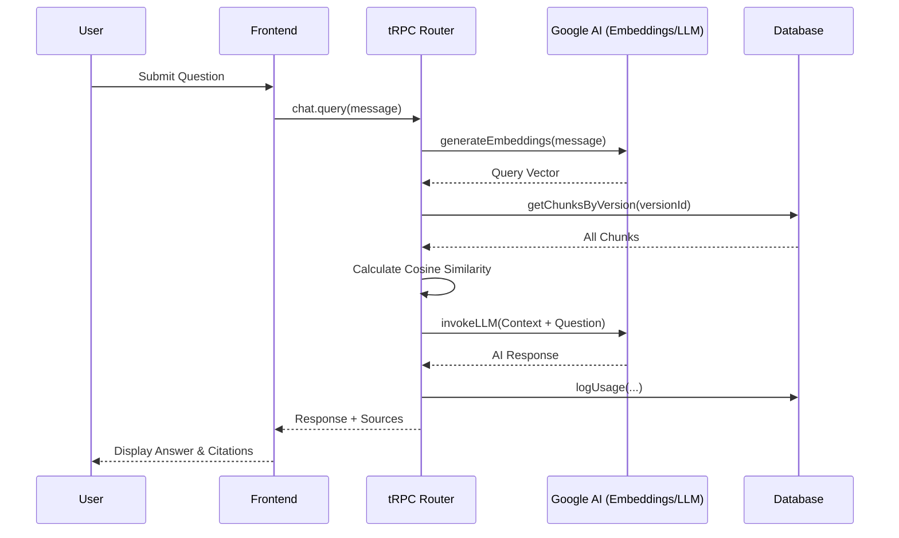

# System Query Flow Walkthrough

This document explains the step-by-step process of how a user query is handled by the RagForge system, from the initial frontend request to the final LLM response with source citations.

## 1. Frontend Interaction
**File:** `client/src/pages/ChatPage.tsx`
- The user enters a message and clicks "Send".
- The `AIChatBox` component calls the `chat.query.useMutation` hook (tRPC).

## 2. API Request Handling
**File:** `server/routers.ts` (Lines 558-654)
- The backend receives the `versionId` and `message`.
- It verifies the user's permissions for the project and pipeline.

## 3. Semantic Retrieval (The "R" in RAG)
### A. Query Embedding
**File:** `server/documentProcessor.ts`
- The system calls `generateEmbeddings([message])`.
- This invokes `gemini-embedding-2` via the Google AI API to create a 768-dimensional vector representing the query's meaning.

### B. Vector Search
- The system fetches all document chunks for the specified `versionId` from the database.
- **Cosine Similarity Calculation**: It iterates through the chunks and calculates how "close" each chunk's embedding is to the query embedding.
- **Sorting**: Chunks are sorted by similarity score, and the top 3 are selected.

## 4. Response Generation (The "G" in RAG)
### A. Context Assembly
- The system joins the text of the top 3 chunks into a single string called `context`.
- It includes metadata like `documentId` and `pageNumber` for each chunk.

### B. LLM Invocation
**File:** `server/_core/llm.ts`
- The system calls `invokeLLM` with the currently configured model (e.g., `gemini-1.5-flash`).
- **Prompt Structure**:
  - **System Role**: "You are a helpful assistant. Answer the user's question based on the provided context..."
  - **User Role**: "Context: [RETRIEVED_TEXT] \n\n Question: [USER_QUERY]"

## 5. Final Output & Logging
- **Response**: The LLM output is returned to the frontend.
- **Sources**: Metadata for the relevant chunks is also returned to display "Source Citations".
- **Analytics**: The `tokensUsed` and `responseTimeMs` are logged to the `usage_logs` table via `db.logUsage`.

## Diagram

-----------------------------------------
## How system responds to a query:

The pipeline searches across all documents that are part of the specific pipeline version you are querying, but it does so in an intelligent way called Vector Search.

Here is a breakdown of exactly how it responds to a query:

1. The Search Scope
When you send a query, the system identifies the Current Version of your pipeline. It then searches through every single document that has been successfully ingested into that version. It does not skip documents; it ensures the entire knowledge base for that version is considered.

2. How it Processes the Query (The "Vector" Secret)
The system doesn't just look for exact keyword matches. Instead, it follows these steps:

Query Embedding: Your question is converted into a high-dimensional mathematical vector (using gemini-embedding-2). This vector represents the meaning of your question.
Cosine Similarity: The system compares your query vector against the vectors of every text "chunk" from all your documents. It calculates a "similarity score" for each piece of text.
Ranking: It ranks all chunks across all documents from most relevant to least relevant.

3. Generating the Response
Once the search is complete:

Context Selection: It picks the Top-K most relevant chunks (usually the top 3 for chat or top 5 for search).
Grounded Answer: These specific chunks are sent to the LLM (Gemini) as "Context." The AI is instructed: "Answer the user's question ONLY using this provided context."
Sources: The system returns the AI's answer along with the specific document names and page numbers where it found the information.

4. Summary of Implementation
Technically, the backend performs a "brute-force" similarity search over the version's data:

It fetches all chunks for all documents in the version from the database.
It calculates the Cosine Similarity for each one in memory.
It sorts them and uses the best ones to "prime" the AI.
This ensures that even if you have dozens of documents, the AI "sees" the most relevant parts of all of them before it speaks.