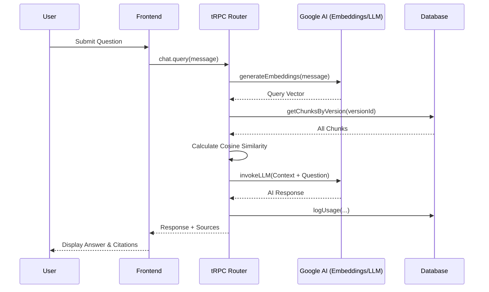

# System Query Flow Walkthrough

This document explains the step-by-step process of how a user query is handled by the RagForge system, from the initial frontend request to the final LLM response with source citations.

## 1. Frontend Interaction
**File:** `client/src/pages/ChatPage.tsx`
- The user enters a message and clicks "Send".
- The `AIChatBox` component calls the `chat.query.useMutation` hook (tRPC).

## 2. API Request Handling
**File:** `server/routers.ts` (Lines 558-654)
- The backend receives the `versionId` and `message`.
- It verifies the user's permissions for the project and pipeline.

## 3. Semantic Retrieval (The "R" in RAG)
### A. Query Embedding
**File:** `server/documentProcessor.ts`
- The system calls `generateEmbeddings([message])`.
- This invokes `gemini-embedding-2` via the Google AI API to create a 768-dimensional vector representing the query's meaning.

### B. Vector Search
- The system fetches all document chunks for the specified `versionId` from the database.
- **Cosine Similarity Calculation**: It iterates through the chunks and calculates how "close" each chunk's embedding is to the query embedding.
- **Sorting**: Chunks are sorted by similarity score, and the top 3 are selected.

## 4. Response Generation (The "G" in RAG)
### A. Context Assembly
- The system joins the text of the top 3 chunks into a single string called `context`.
- It includes metadata like `documentId` and `pageNumber` for each chunk.

### B. LLM Invocation
**File:** `server/_core/llm.ts`
- The system calls `invokeLLM` with the currently configured model (e.g., `gemma-4-31b-it`).
- **Prompt Structure**:
  - **System Role**: "You are a helpful assistant. Answer the user's question based on the provided context..."
  - **User Role**: "Context: [RETRIEVED_TEXT] \n\n Question: [USER_QUERY]"

## 5. Final Output & Logging
- **Response**: The LLM output is returned to the frontend.
- **Sources**: Metadata for the relevant chunks is also returned to display "Source Citations".
- **Analytics**: The `tokensUsed` and `responseTimeMs` are logged to the `usage_logs` table via `db.logUsage`.

## Diagram

